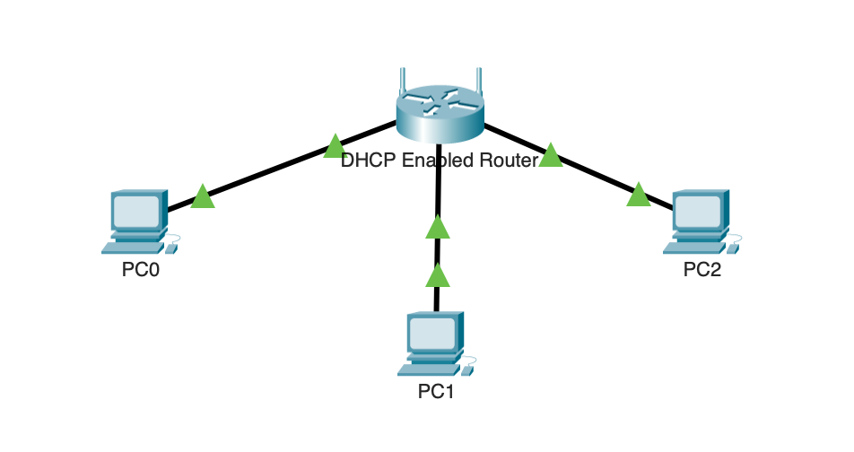
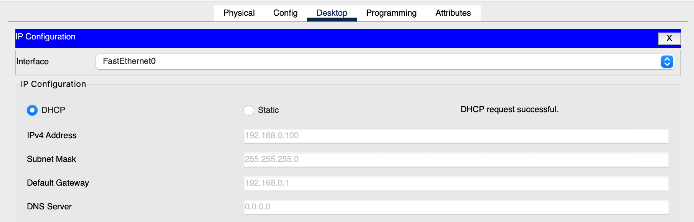
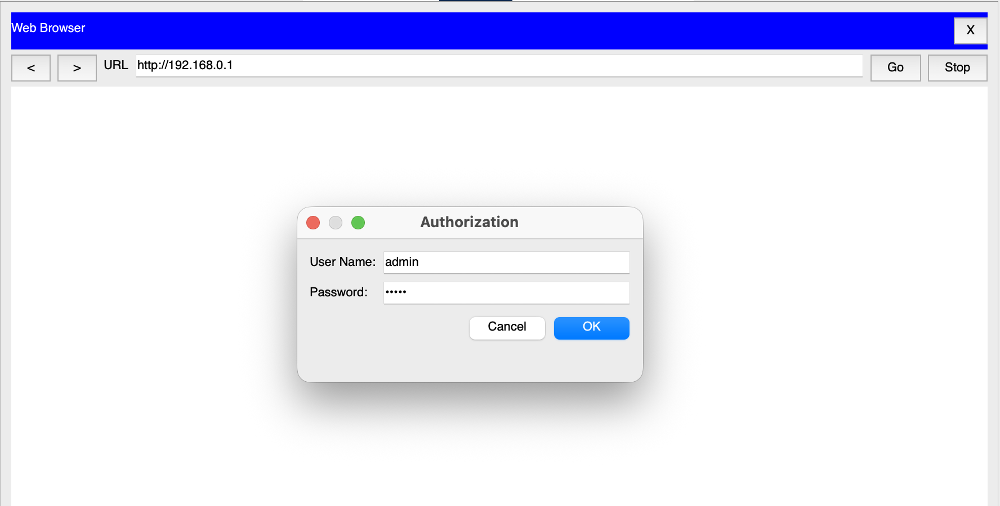
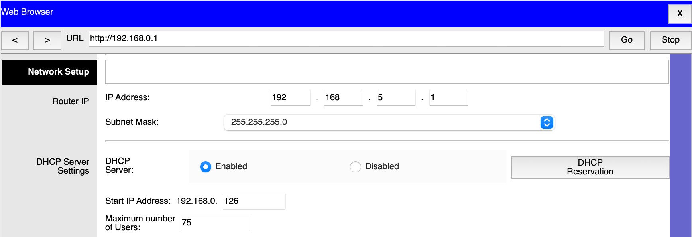
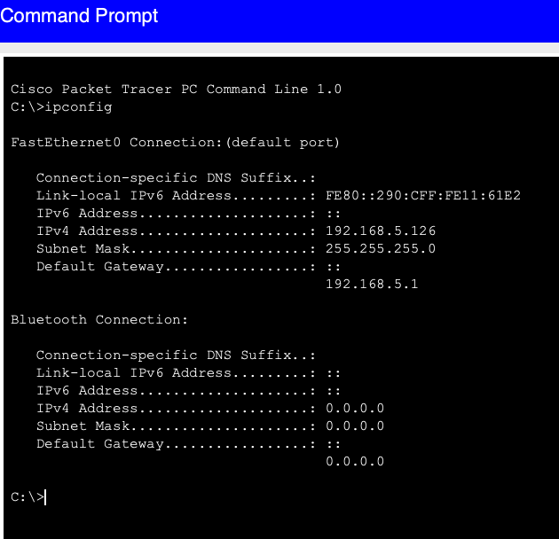

## Objectif

Configurer un routeur sans fil comme serveur DHCP afin d'attribuer automatiquement des adresses IP à plusieurs clients et vérifier leur connectivité.

## Compétences mises en œuvre

- Configuration d'un serveur DHCP
- Modification de l'adresse IP d'un routeur
- Personnalisation d'une plage d'adresses DHCP
- Configuration de clients en DHCP
- Vérification de la configuration réseau (`ipconfig`)
- Validation de la connectivité avec `ping`

## Étapes réalisées

1. Connexion de trois PC au routeur sans fil.
2. Analyse de la configuration DHCP par défaut.
3. Modification de l'adresse IP du routeur en `192.168.5.1`.
4. Configuration de la plage DHCP (Changez le début de l'adresse IP de `192.168.5.100` à `192.168.5.126`., 75 clients).
5. Attribution automatique des adresses IP aux trois ordinateurs.
6. Vérification de la connectivité entre tous les équipements à l'aide de `ipconfig` et `ping`.

## Résultat

Le routeur attribue automatiquement une adresse IP aux clients via DHCP. Les trois ordinateurs communiquent correctement entre eux et avec le routeur.

---

## Captures d'écrans

---

---

---

---

