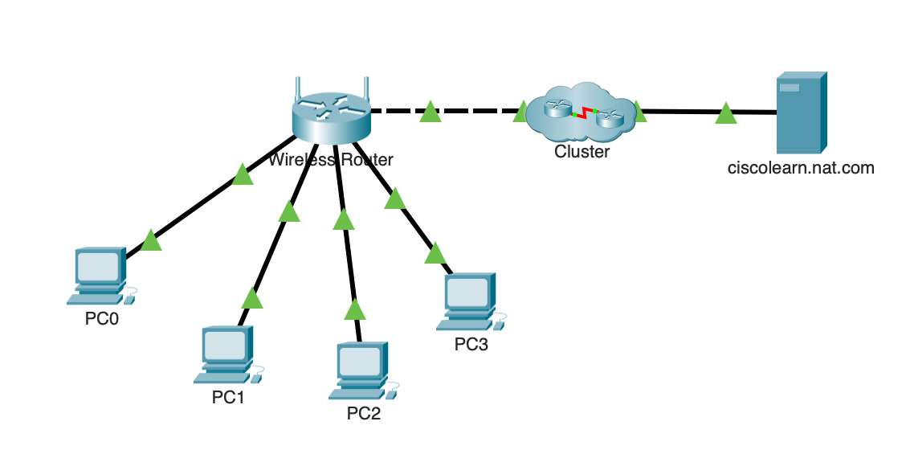
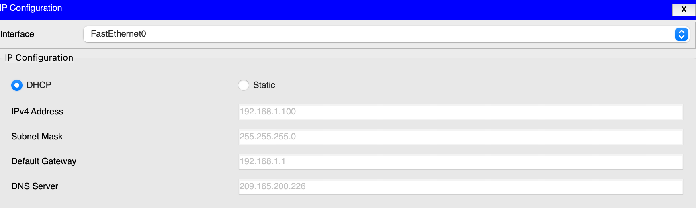
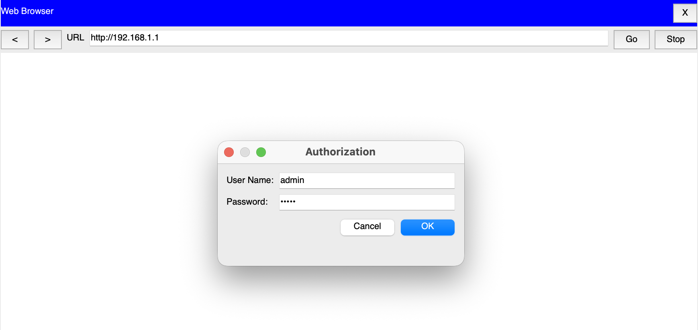
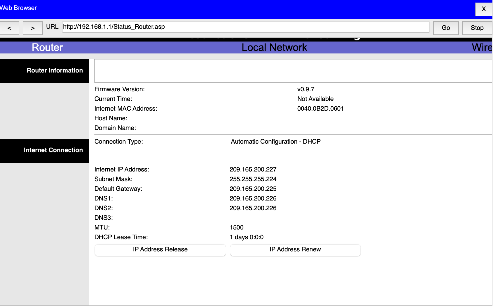
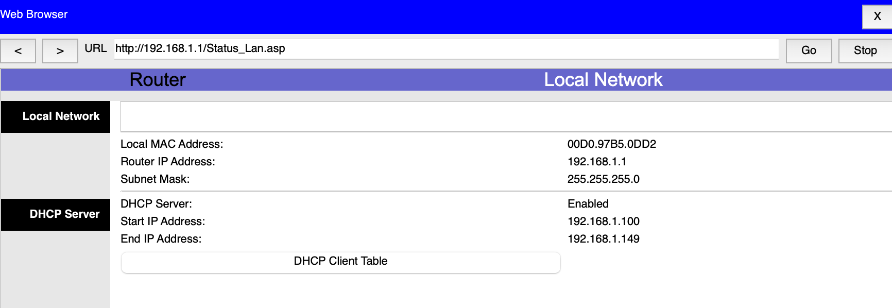
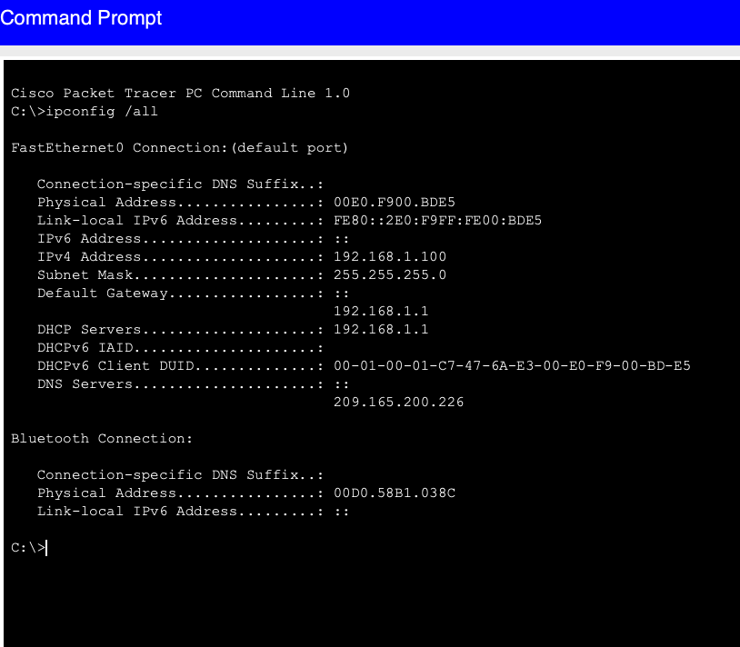

## Objectif

Comprendre le fonctionnement de la traduction d'adresses réseau (NAT) sur un routeur sans fil et analyser son rôle dans la communication entre un réseau privé et Internet.

## Compétences mises en œuvre

- Analyse du fonctionnement du NAT
- Configuration de clients en DHCP
- Identification des adresses IP publiques et privées
- Observation de la traduction d'adresses sur un routeur
- Analyse des paquets en mode Simulation
- Vérification de la connectivité réseau

## Étapes réalisées

1. Configuration d'un premier client en DHCP.
2. Analyse des interfaces WAN (publique) et LAN (privée) du routeur.
3. Connexion de quatre ordinateurs au réseau local.
4. Vérification de l'attribution automatique des adresses IP.
5. Simulation d'une communication HTTP vers un serveur externe.
6. Observation de la traduction NAT et des modifications des en-têtes IP.

## Résultat

Le routeur traduit les adresses IP privées du réseau local en une adresse IP publique grâce au NAT, permettant aux postes internes d'accéder aux ressources externes tout en masquant leur adresse privée.

---

## Captures d'écrans

---

---

---

---

---

---

---

---

---

