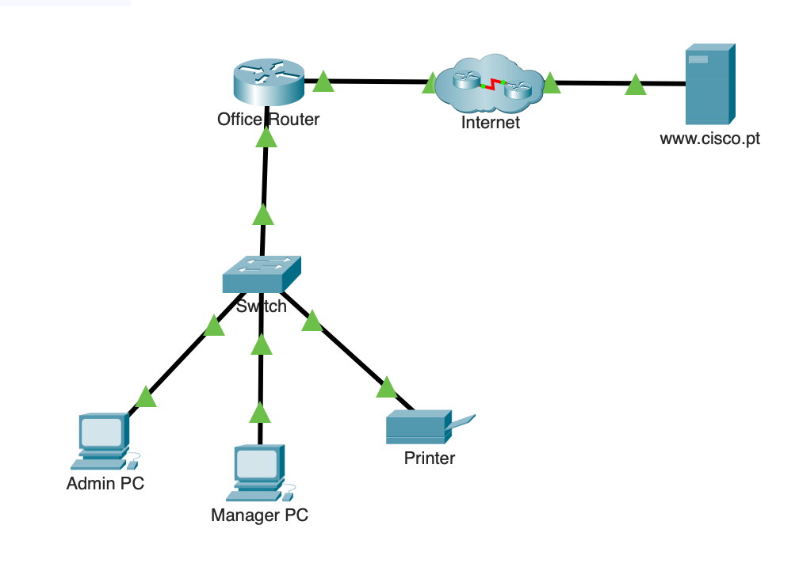
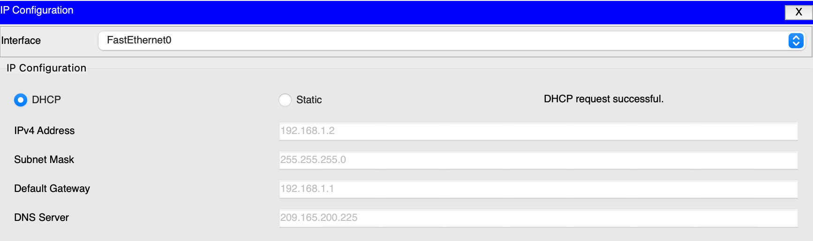
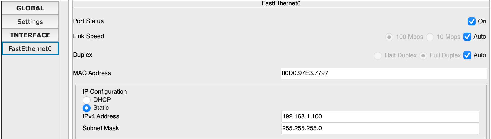
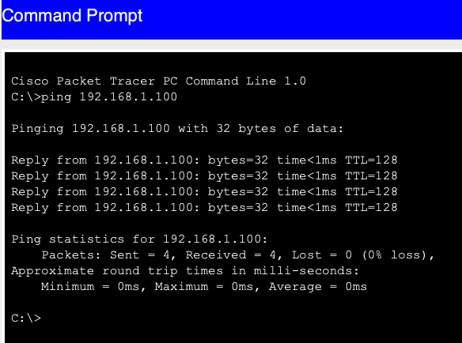
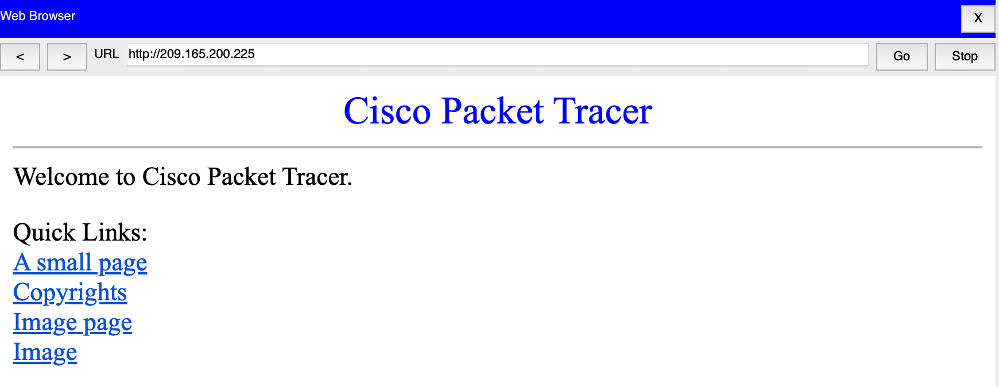
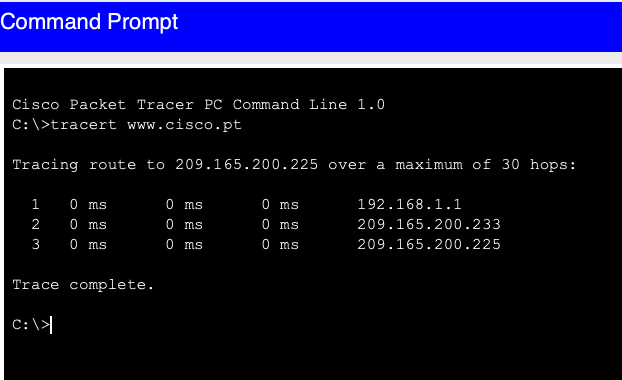

## Objectif

Créer un réseau local (LAN) fonctionnel en connectant les équipements, en configurant l'adressage IPv4 et en vérifiant la communication entre les différents hôtes.

## Compétences mises en œuvre

- Création d'un réseau local (LAN)
- Connexion des équipements réseau (routeur, switch, PC, imprimante)
- Configuration IPv4 statique et dynamique (DHCP)
- Vérification de la connectivité avec `ping`
- Analyse de la configuration réseau avec `ipconfig`
- Analyse du chemin réseau avec `tracert`

## Étapes réalisées

1. Connexion des équipements selon la topologie du réseau.
2. Configuration des postes clients en DHCP.
3. Attribution d'une adresse IP statique à l'imprimante.
4. Vérification de la connectivité entre les postes, l'imprimante et Internet.
5. Utilisation des commandes `ipconfig` et `tracert` pour analyser le réseau.

## Résultat

Le réseau local est entièrement opérationnel. Les postes reçoivent automatiquement leur configuration IP, communiquent avec les équipements du LAN et accèdent aux ressources distantes.

---

## Captures d'écrans

---

---

---

---

---

