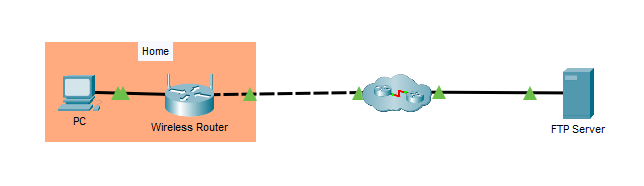
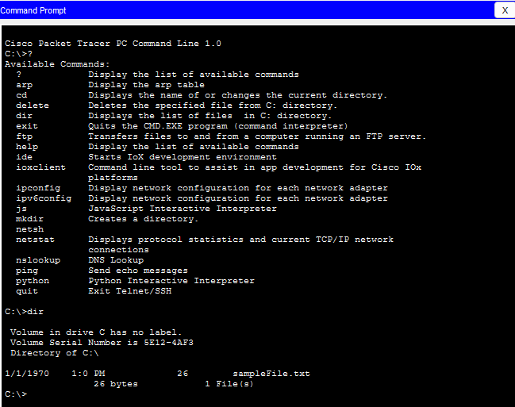
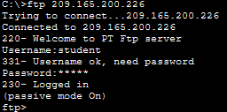
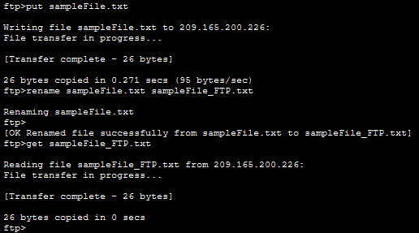
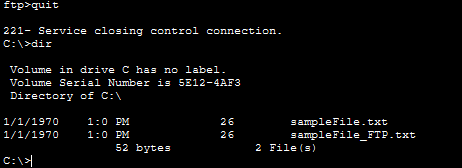
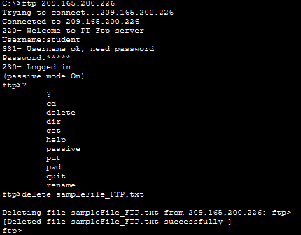

## Objectif

Utiliser le protocole FTP pour transférer des fichiers entre un client et un serveur en effectuant des opérations d'envoi, de téléchargement, de renommage et de suppression.

## Compétences mises en œuvre

- Utilisation du protocole FTP
- Connexion à un serveur FTP
- Authentification avec un compte utilisateur
- Envoi et téléchargement de fichiers
- Gestion des fichiers à distance (renommer, supprimer)
- Utilisation des commandes FTP en ligne de commande

## Étapes réalisées

1. Connexion au serveur FTP avec des identifiants.
2. Envoi d'un fichier (`put`) vers le serveur.
3. Vérification du contenu du serveur (`dir`).
4. Renommage du fichier sur le serveur (`rename`).
5. Téléchargement du fichier vers le poste client (`get`).
6. Suppression du fichier du serveur (`delete`).

## Résultat

Les transferts de fichiers entre le client et le serveur FTP sont réalisés avec succès. Les principales commandes FTP sont maîtrisées pour administrer les fichiers à distance.

---

## Captures d'écrans

---

---

---

---

---

