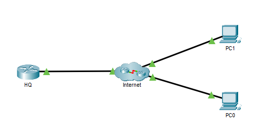
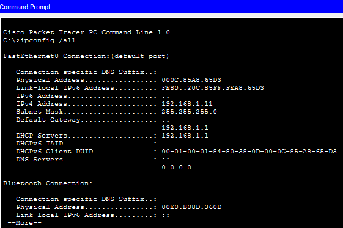
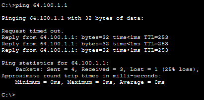
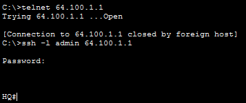

## Objectif

Établir une connexion distante vers un routeur en utilisant les protocoles Telnet et SSH, et comprendre les différences entre un accès non sécurisé et un accès sécurisé.

## Compétences mises en œuvre

- Vérification de la connectivité réseau
- Attribution d'une adresse IP via DHCP
- Test de connectivité avec `ping`
- Accès distant avec Telnet
- Accès distant sécurisé avec SSH
- Authentification sur un équipement Cisco

## Étapes réalisées

1. Vérification de la configuration IP du poste client.
2. Test de la connectivité vers le routeur avec `ping`.
3. Tentative de connexion via Telnet.
4. Connexion sécurisée au routeur avec SSH.
5. Authentification et accès à l'interface en ligne de commande (CLI).

## Résultat

La connexion Telnet est refusée pour des raisons de sécurité, tandis que l'accès SSH permet une administration distante sécurisée du routeur.

## Captures d'écrans

---

---

---

