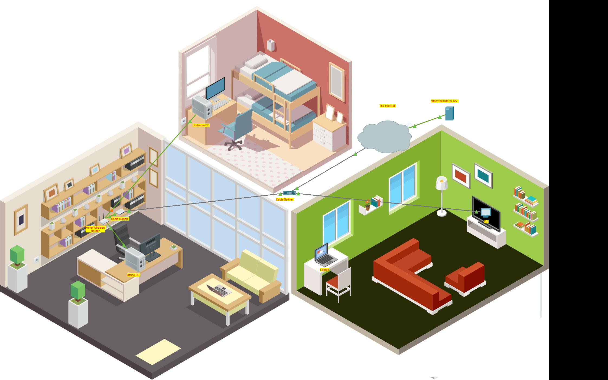
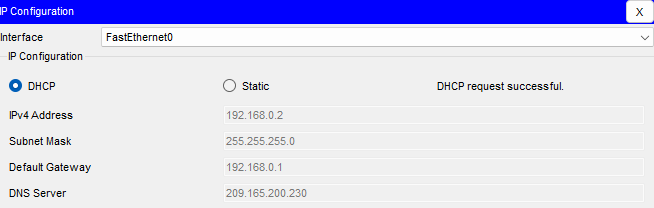
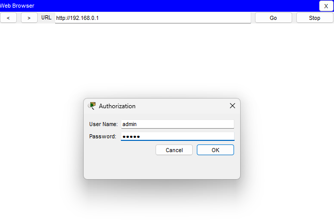
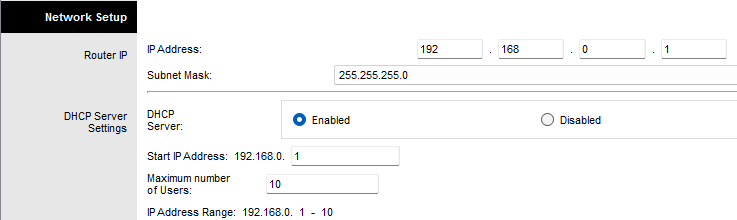
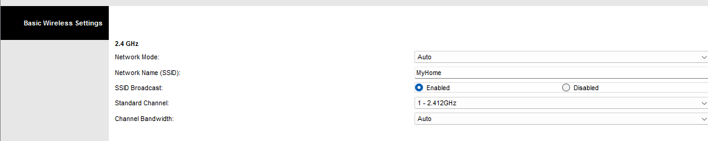
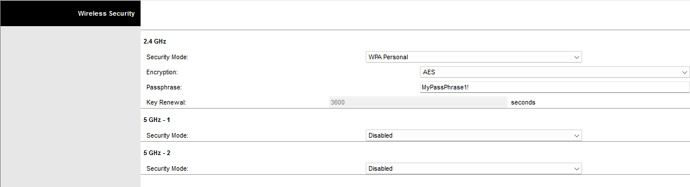
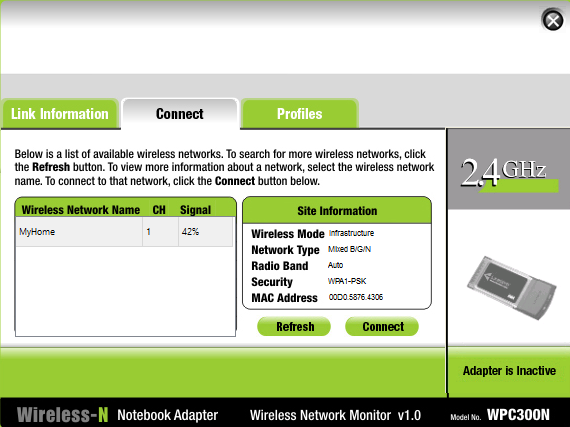
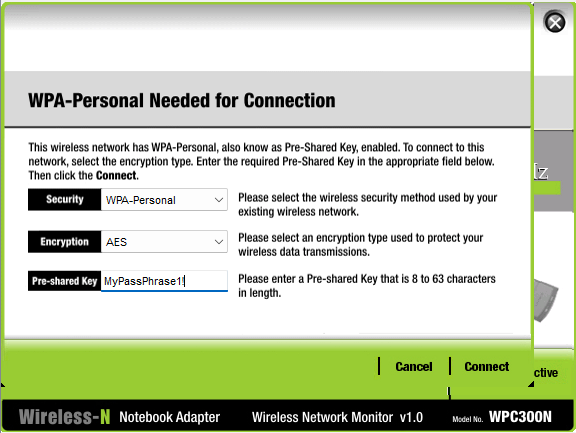
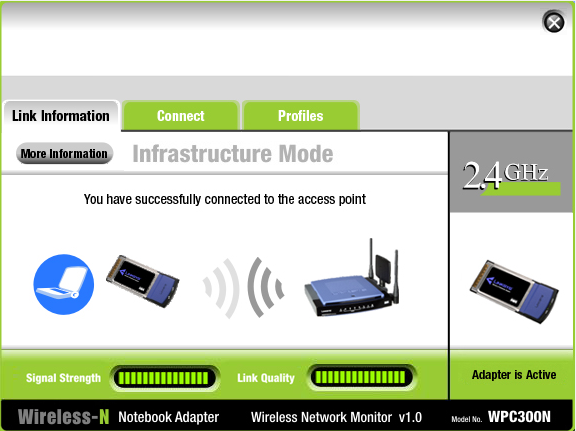

## Objectif

Configurer un routeur sans fil domestique afin de fournir un accès Internet sécurisé aux équipements filaires et Wi-Fi grâce au DHCP et au réseau sans fil.

## Compétences mises en œuvre

- Installation d'un réseau domestique
- Configuration d'un routeur sans fil
- Configuration du serveur DHCP
- Configuration d'un réseau Wi-Fi (SSID)
- Sécurisation du Wi-Fi avec WPA2 Personal
- Modification des identifiants d'administration
- Connexion de clients filaires et sans fil
- Vérification de la connectivité Internet

## Étapes réalisées

1. Connexion des équipements (modem, routeur, PC et ordinateur portable).
2. Configuration du routeur via son interface Web.
3. Personnalisation des paramètres DHCP.
4. Modification du mot de passe administrateur.
5. Création d'un réseau Wi-Fi sécurisé (SSID et WPA2).
6. Configuration des clients en DHCP.
7. Vérification de l'accès au réseau local et à Internet.

## Résultat

Le réseau domestique est entièrement opérationnel. Les appareils filaires et sans fil obtiennent automatiquement une adresse IP, se connectent au réseau Wi-Fi sécurisé et accèdent à Internet avec succès.

---

## Captures d'écrans

---

---

---

---

---

---

---

---

---

