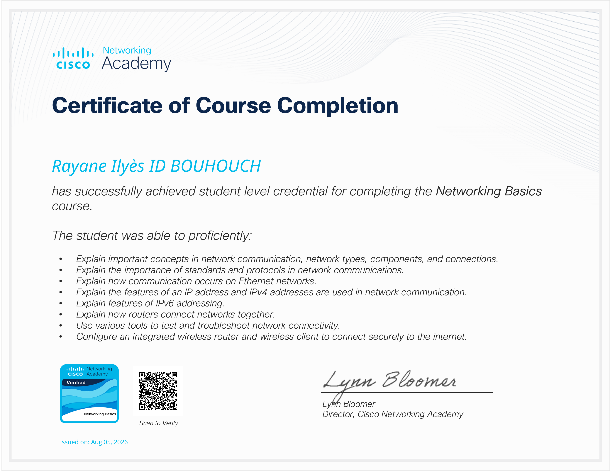

# Cisco Networking Basics

## Certification

**Formation :** Cisco Networking Basics
**Plateforme :** Cisco Networking Academy
**Statut :** ✅ Terminée

---

## Présentation

Ce dossier regroupe les connaissances, exercices et travaux pratiques réalisés dans le cadre de la formation **Cisco Networking Basics**.

L'objectif de cette formation était d'acquérir les bases fondamentales des réseaux informatiques et de mettre en pratique les notions étudiées à l'aide de **Cisco Packet Tracer**.

---

## Objectifs

* Comprendre le fonctionnement général d'un réseau informatique
* Comprendre le modèle OSI
* Comprendre le modèle TCP/IP
* Découvrir les principaux équipements réseau
* Comprendre le fonctionnement d'Ethernet
* Comprendre l'adressage IPv4
* Manipuler les masques de sous-réseau
* Découvrir le subnetting
* Comprendre les principaux protocoles réseau
* Réaliser des configurations réseau simples
* Effectuer des tests de connectivité
* Identifier et résoudre des problèmes réseau

---

## Compétences travaillées

### Réseaux

* Modèle OSI
* Modèle TCP/IP
* LAN / WAN
* Topologies réseau
* Communication réseau
* Encapsulation des données

### Adressage IP

* IPv4
* Adresse réseau
* Adresse hôte
* Adresse de broadcast
* Masque de sous-réseau
* CIDR
* Subnetting

### Ethernet

* Trames Ethernet
* Adresses MAC
* Switch
* Communication unicast
* Communication broadcast

### Protocoles réseau

* ARP
* ICMP
* DHCP
* DNS
* TCP
* UDP

### Dépannage

* `ping`
* Vérification de la configuration IP
* Tests de connectivité
* Identification des problèmes réseau
* Correction des erreurs de configuration

---

**Portfolio :** `IT-Portfolio`
